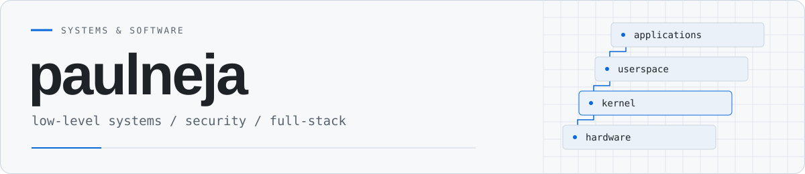

<picture>
  <source media="(prefers-color-scheme: dark)" srcset="assets/profile-header-dark.svg" />
  
</picture>

  <a href="mailto:jeremiasnejanky360@gmail.com">Email</a>
  &nbsp;&middot;&nbsp;
  <a href="https://github.com/paulneja?tab=repositories">Repositories</a>
  &nbsp;&middot;&nbsp;
  <a href="#notes-from-the-projects">Technical notes</a>

Most of my public work is around Linux: kernel changes, boot chains and software
for small machines. I also build full-stack applications and run DevPocket.

## Selected work

### [Linux on ESP32-S3](https://github.com/paulneja/Linux-on-esp32-S3)

**Linux 7.2.4 on an ESP32-S3, running natively.** Wi-Fi, SSH, Bash,
MicroPython and hardware RSA on a board with 16 MB of flash and 8 MB of PSRAM.
ESP-IDF handles networking on core 0; Linux runs on core 1.

A lot of the recent work has gone into `fork()`. It uses swapped memory banks,
with the S3's cache MMU remapping aligned 64 KiB regions instead of copying them
on every switch. Still NOMMU: no per-process memory protection, no copy-on-write.

<table>
<tr>
<td width="55%" valign="top">

<strong>29.3 ms &rarr; 5.2&ndash;5.6 ms</strong>

Worst measured switch between three busy Bash processes. Same 0.9 image,
cache-MMU path off vs. on.

</td>
<td width="45%" valign="top">

<strong>0.9, tested on the board</strong>

36/36 board tests &middot; 10/10 extra checks 
20/20 clean cold boots

</td>
</tr>
</table>

[Release verification](https://github.com/paulneja/Linux-on-esp32-S3/blob/main/build/verification/2026-10-04-release.md)
&middot; [Architecture](https://github.com/paulneja/Linux-on-esp32-S3/blob/main/ARCHITECTURE.md)
&middot; [Kernel tree](https://github.com/paulneja/linux-esp32s3)
&middot; [Try it](https://github.com/paulneja/Linux-on-esp32-S3#quick-start)

Watch it boot on the board

 

Recorded from the board's serial console. Long pauses are shortened to 1.6 seconds.

### [Zevory Linux](https://github.com/paulneja/Zevory-Linux)

A Linux distribution built from upstream sources, starting with the boot chain
and userspace. Limine, a musl-based initramfs, and
[ZevInit](https://github.com/paulneja/Zevory-Linux/tree/main/zevinit): a small
PID 1 written in Rust, with shell lifecycle management, orphan reaping and
shutdown handling.

The bootstrap has run on real hardware. ZevInit has been tested in QEMU,
not on real hardware yet.

### [SysCage](https://github.com/paulneja/Syscage)

A Linux malware-analysis sandbox built around namespaces and syscall tracing.
Bash orchestration, temporary root filesystems, ELF execution and Windows PE
support through Wine. Captures traces, network traffic and dropped files for
analysis.

Shared-kernel isolation, not a VM boundary. Intended for disposable
analysis environments.

## Notes from the projects

- [How Linux and ESP-IDF share the S3, and how the memory banks work](https://github.com/paulneja/Linux-on-esp32-S3/blob/main/ARCHITECTURE.md)
- [The 0.9 image, its hashes and what actually ran on the board](https://github.com/paulneja/Linux-on-esp32-S3/blob/main/build/verification/2026-10-04-release.md)
- [What ZevInit does, what it doesn't, and what the tests cover](https://github.com/paulneja/Zevory-Linux/blob/main/zevinit/README.md)

## Tools I work with

| Area | Tools |
| :-- | :-- |
| Systems | C, C++, Rust, Bash, Linux, Xtensa |
| Applications | TypeScript, JavaScript, Python, Java, Kotlin, SQL |
| Build & boot | Buildroot, ESP-IDF, Make, CMake, Limine, musl |
| Debugging & infrastructure | GDB, OpenOCD, strace, QEMU/KVM, Docker, GitHub Actions |

---

<picture>
  <source media="(prefers-color-scheme: dark)" srcset="https://raw.githubusercontent.com/paulneja/paulneja/output/github-snake-dark.svg" />
  <source media="(prefers-color-scheme: light)" srcset="https://raw.githubusercontent.com/paulneja/paulneja/output/github-snake.svg" />
  
</picture>

