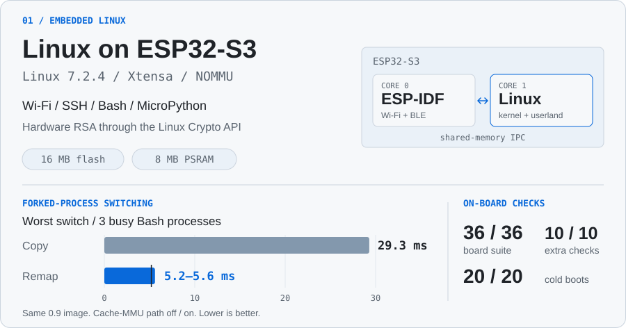
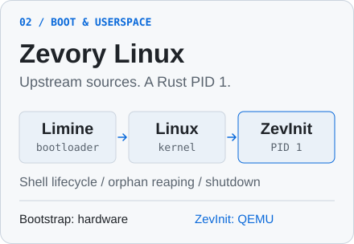
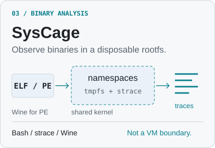

<picture>
  <source media="(prefers-color-scheme: dark)" srcset="assets/profile-header-dark.svg" />
  
</picture>

  <a href="mailto:paulnejacontacto@gmail.com">Email</a>
  &nbsp;&middot;&nbsp;
  <a href="https://github.com/paulneja?tab=repositories">Repositories</a>
  &nbsp;&middot;&nbsp;
  <a href="#notes-from-the-projects">Technical notes</a>

Most of my public work is around Linux: kernel changes, boot chains and software
for small machines. I also build full-stack applications and run DevPocket.

## Selected work

<a href="https://github.com/paulneja/Linux-on-esp32-S3">
<picture>
  <source media="(max-width: 600px) and (prefers-color-scheme: dark)" srcset="assets/esp32-mobile-dark.svg" />
  <source media="(max-width: 600px)" srcset="assets/esp32-mobile.svg" />
  <source media="(prefers-color-scheme: dark)" srcset="assets/esp32-dark.svg" />
  
</picture>
</a>

  <a href="https://github.com/paulneja/Linux-on-esp32-S3#quick-start"><b>Flash it</b></a>
  &nbsp;&middot;&nbsp;
  <a href="https://github.com/paulneja/Linux-on-esp32-S3/blob/main/build/verification/2026-10-04-release.md">Measurements</a>
  &nbsp;&middot;&nbsp;
  <a href="https://github.com/paulneja/linux-esp32s3">Kernel source</a>
   
  Cache-MMU remapping speeds up bank switching. Still no per-process protection or copy-on-write.

  
   
  From the board's serial console. Long pauses shortened to 1.6 seconds.

<a href="https://github.com/paulneja/Zevory-Linux"><picture>
  <source media="(prefers-color-scheme: dark)" srcset="assets/zevory-dark.svg" />
  
</picture></a>
<a href="https://github.com/paulneja/Syscage"><picture>
  <source media="(prefers-color-scheme: dark)" srcset="assets/syscage-dark.svg" />
  
</picture></a>

## Notes from the projects

  <a href="https://github.com/paulneja/Linux-on-esp32-S3/blob/main/ARCHITECTURE.md">Inside the S3 port</a>
  &nbsp;&middot;&nbsp;
  <a href="https://github.com/paulneja/Linux-on-esp32-S3/blob/main/build/verification/2026-10-04-release.md">Release verification</a>
  &nbsp;&middot;&nbsp;
  <a href="https://github.com/paulneja/Zevory-Linux/blob/main/zevinit/README.md">Inside ZevInit</a>

---

<picture>
  <source media="(prefers-color-scheme: dark)" srcset="https://raw.githubusercontent.com/paulneja/paulneja/output/github-snake-dark.svg" />
  <source media="(prefers-color-scheme: light)" srcset="https://raw.githubusercontent.com/paulneja/paulneja/output/github-snake.svg" />
  
</picture>

